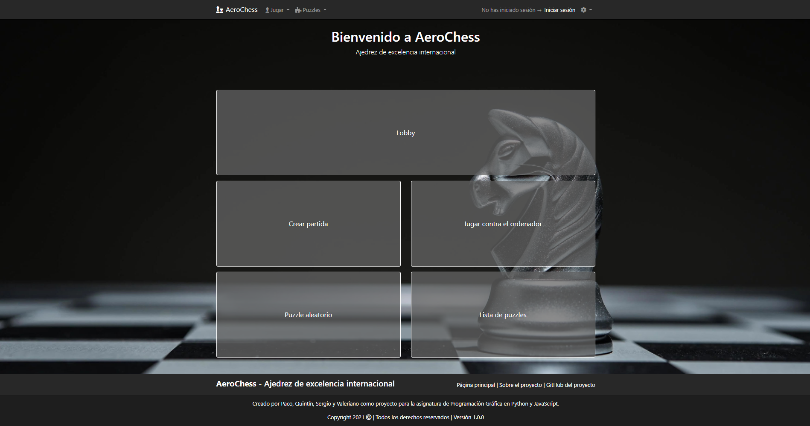
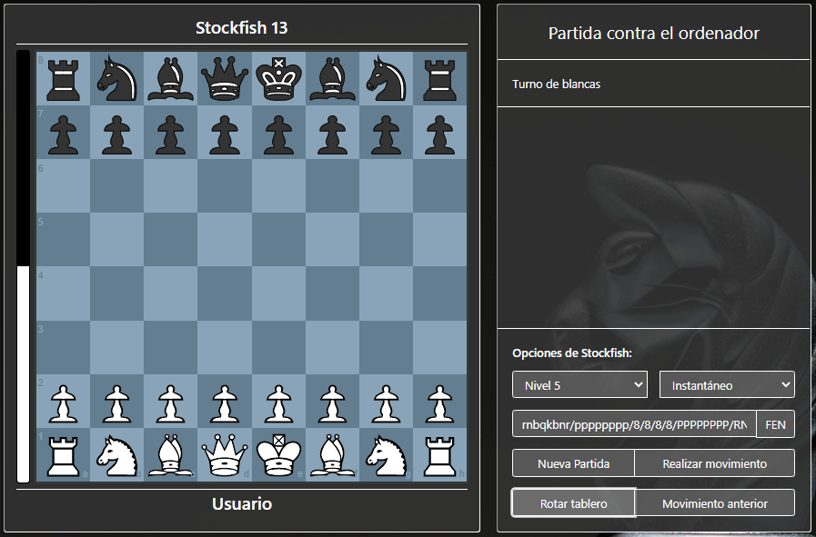
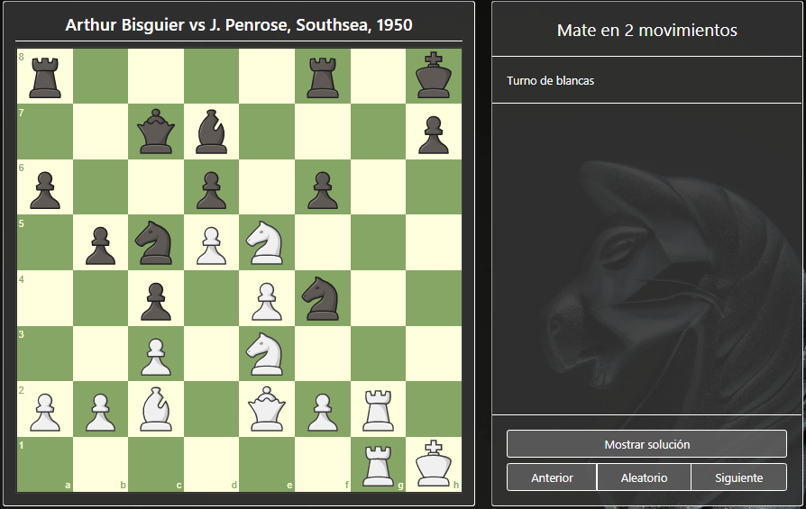

<p align="center">
        
    </a>
</p>

<h1 align="center" style="font-size:50px;">AeroChess</h1>

En este documento se recoge:
* La documentación empleada.
* Las ideas a implementar
* Nuestos objetivos durante el Proyecto
* La Pagina Final
* La Funcionalidad por Encima de todo
* Los bugs encontrados.
* Un tutorial sobre cómo contribuir.

# Webs de consulta

* Desarrollo web de mozilla: https://developer.mozilla.org/en-US/docs/

* Libro de Python: https://greenteapress.com/wp/think-python/

* Documentación Python: https://docs.python.org/3/

* Documentación Django: https://docs.djangoproject.com/en/3.1/

* Documentación Bootstrap: https://getbootstrap.com/docs/4.6/

* Stockfish en Python: https://github.com/zhelyabuzhsky/stockfish.

* Tablero de ajedrez en JavaScript: https://chessboardjs.com/.

# Ideas a implementar
<div style="text-align: justify"> 
* Un modo de juego de un jugador contra la máquina, que será el mejor motor de ajedrez del mundo, Stockfish.

* Un sistema de autenticación para que los usuarios puedan registrarse y autenticarse.

* Un modo multijudador online mediante un sistema de creación de partidas a las que otro jugador se pueda unir:
    * Desde un  lobby  para partidas públicas.
    * Mediante una invitación para partidas privadas.

* Distintos tipos de partida multijugador en función por ejemplo del tiempo permitido para jugar.

* Un modo de puzzles donde el jugador tenga que conseguir determinado objetivo en un número limitado de movimientos.

* Un sistema de personalización de la interfaz que incluya cambios de estilo fichas y tablero y la opción de jugar con o sin sonido.

* Una barra de estado de la partida que muestre qué lado está en una posición más favorable.

* Un registro de partidas completadas (e incluso partidas en curso) al que se pueda acceder desde el perfil del usuario.

* Un modo de "trampas" de manera que se pueda utilizar nuestra página para calcular los mejores movimientos a realizar en partidas que se estén jugando en otras páginas de ajedrez (?).

* Un sistema de clasificación de usuarios registrados similar a los puntos ELO (?).

</div>

# Nuestos objetivos durante el Proyecto

<div style="text-align: justify">
Con el paso de los días las ideas a implementar no han echo mas que crecer pero los objetivos del proyecto han cambiado muy poco, lo que comenzó siendo un objetivo primario como era la inclusión de un modo de "trampas", fue rápidamente descartado por que los sistemas anti-cheat de las paginas que teníamos como objetivo funcionan realmente bien, dado que los motores ajedrecísticos siempre elijen el mejor movimiento visto desde el punto estadístico y no como las personas que planean estrategias y las intentas seguir mientras pueden haciendo en varias ocasiones movimientos que no serian el mejor pasible según el motor, esto hace que las paginas webs puedan analizar si los movimientos son realizados por una maquina o por una persona. Descartada esta idea pronto pensamos en que hacer con el proyecto y la decisión era clara queríamos ver como de funcional podíamos hacer una pagina web sobre ajedrez, con una idea muy clara poner la funcionalidad como eje principal en el diseño de nuestra web, el objetivo ultimo era ser capaces de servir la pagina de forma online y abierta para todo el mundo.   

 </div>
        

# La Pagina Final

<span></span>
<p align="center">
        
</p>
<p>Pensada para abarcar las distintas opciones de juego: modo contra el ordenador, puzzle y multijugador.
Personaliza las fichas y el tablero a tu gusto y desmuestra tu destreza.</p>  
<p>La zona de Lobby muestra las partidas activas y, además, permite a los usuarios unirse a las partidas disponibles. Si lo tuyo no es el ajedrez, o necesitas perfeccionar tu destreza en este deporte, no dudes en usar el modo espectador para visualizar partidas en vivo.</p>

## Modo contra el ordenador
<p align="center">
        
</p>
<p>Nada mejor para aprender que practicar con los distintos niveles de dificultad del ordenador.</p>
<p>Dividida en dos partes, la carta de la derecha permite al jugador visualizar los movimientos realizados hasta el momento, así como usar los distintos botones típicos para realizar movimientos, retroceder, rotar tablero o crear una partida nueva.
La opción FEN permite crear una situación de partida.
El motor Stokfish será un verdadero quebradero de cabeza para ti. </p>

## Modo puzzle
<p align="center">
        
</p>

<p>El modo puzzle permite poner en jaque situaciones reales de partida. Demuestra que eres capaz de vencer a la máquina en pocos movimientos. A pesar de todo, si te atrancas, ¡nunca viene mal echar un vistazo a la solución!</p>

# La Funcionalidad por Encima de todo


# Bugs conocidos


<div style="text-align: justify">

```

# Cómo contribuir

Si estáis utilizando GitHub Desktop, él mismo detectará los cambios que se realicen en el repositorio y podréis llevar un registro de dichos cambios haciendo "commits" a vuestra copia local del repositorio a través de la aplicación.

**NOTA:** los cambios que hagáis de manera local son efectivos tan pronto guardáis el archivo editado desde el editor, pero son registrados por GitHub Desktop hasta que hacéis un "commmit". Es recomendable hacer un "commit" local cada vez que acabéis una sesión de trabajo.

Cuando queráis actualizar el repositorio online con los cambios que habéis hecho de forma local, basta con darle a publicar desde GitHub Desktop y la aplicación se encargará de sincronizar los archivos locales con los archivos online.

**NOTA:** es recomendable antes de hacer cambios en el repositorio online asegurarse de que habéis aplicado los cambios a la versión más actualizada del repositorio online y que funciona, para minimizar la posibilidad de que vuestros cambios rompan el proyecto.

**NOTA 2:** Los cambios se aplican a la rama del proyecto que tengáis seleccionada, si esa rama no existiera en el repositorio online pero sí en el repositorio local, sería creada cuando publicarais los cambios.

 </div>